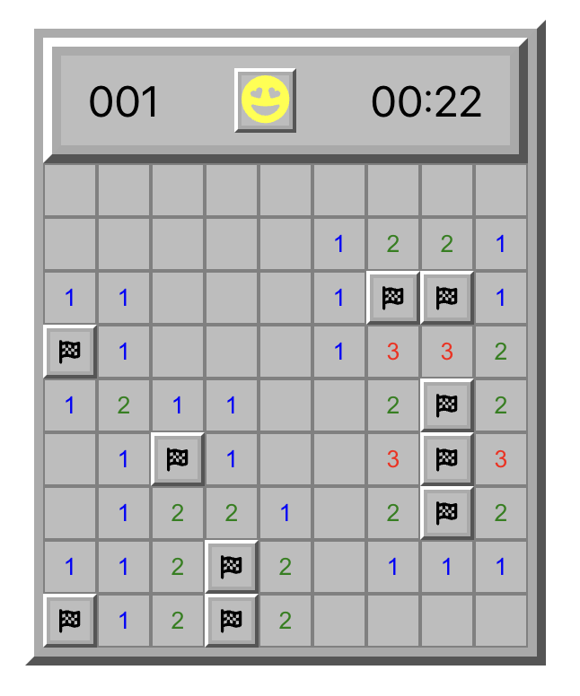

# Mine Sweeper

A typescript and react version of mine sweeper.



## Get started

The component is developed and previewed in Storybook:

```
yarn storybook
```

## Develop

```
yarn test        # run the Vitest suite
yarn test:watch  # watch mode
yarn lint        # ESLint
yarn typecheck   # tsc --noEmit
yarn ts-build    # build the publishable library (dist/)
```

## Deploy

Releases are published to npm. The steps below build the library (`dist/`)
from source, tag the release, and publish it.

```
# 1. Make sure tests pass and the working tree is clean
yarn test

# 2. Add a CHANGELOG.md entry for the new version

# 3. Bump the version + create the git tag (patch / minor / major).
#    This updates package.json and creates a `vX.Y.Z` tag.
npm version patch

# 4. Publish (prepublishOnly rebuilds dist/ from tsconfig.build.json)
npm publish

# 5. Push the commit and tag
git push --follow-tags
```

> Note: the published library is built by `yarn ts-build`
> (`tsconfig.build.json`), which `prepublishOnly` runs automatically. Tests run
> on Vitest and Storybook builds with Vite.

See [CHANGELOG.md](./CHANGELOG.md) for release notes.
